# C4 Component Diagram — Enterprise API Bounded Context

Core components within the Enterprise Options API layer.

```mermaid
graph TB
    subgraph Options["Enterprise Options Classes"]
        AgGridEnt["<b>AgGridEnterprise</b><br/>Component root<br/>Extends AgGrid, adds enterprise methods"]
        AgGridEntOpts["<b>AgGridEnterpriseOptions</b><br/>POJO with enterprise-only fields<br/>Charts, Range, SideBar, StatusBar<br/>Row Groups, Server-Side Model"]
        ChartOpts["<b>ChartOptions</b><br/>enableCharts: Boolean<br/>chartThemes: List<CharTheme><br/>chartThemeOverrides: Object<br/>chartToolPanelsDef, suppressChartToolPanelsOverlay"]
        RangeOpts["<b>RangeSelectionOptions</b><br/>enableRangeSelection: Boolean<br/>suppressCopyRowsToClipboard<br/>suppressCopySingleCellRanges"]
        SideBarOpts["<b>SideBarOptions</b><br/>enableSideBar: Boolean<br/>sideBarDef: SideBarDef<br/>toolPanels: List<SideBarToolPanelDef>"]
        StatusBarOpts["<b>StatusBarOptions</b><br/>statusBar: StatusBarDef<br/>statusPanels: List<StatusBarPanelDef>"]
        GroupOpts["<b>RowGroupingOptions</b><br/>rowGroupPanelShow: PanelShow<br/>groupHierarchyConfig: Map<String, Object><br/>groupAllowUnbalanced: Boolean<br/>groupHideParentOfSingleChild"]
        ServerSideOpts["<b>ServerSideOptions</b><br/>rowModelType: RowModelType = serverSide<br/>serverSideStoreType, cacheBlockSize<br/>maxBlocksInCache, purgeClosedRowNodes"]
    end
    
    subgraph Models["Domain Models (DTOs)"]
        SideBarDef["<b>SideBarDef</b><br/>toolPanels: List<SideBarToolPanelDef><br/>position: string"]
        SideBarToolPanelDef["<b>SideBarToolPanelDef</b><br/>id: string<br/>labelKey: string<br/>labelDefault: string<br/>iconKey: string"]
        StatusBarDef["<b>StatusBarDef</b><br/>statusPanels: List<StatusBarPanelDef>"]
        StatusBarPanelDef["<b>StatusBarPanelDef</b><br/>statusPanelId: string<br/>statusPanelClass, statusPanelComp<br/>align: string"]
        ChartTheme["<b>ChartTheme</b><br/>Enum: AG_DEFAULT, AG_VIVID<br/>AG_MATERIAL, AG_SHEETS<br/>POLYCHROMA"]
        RowModelType["<b>RowModelType</b><br/>Enum: CLIENT_SIDE, SERVER_SIDE<br/>VIEWPORT, INFINITE"]
        PanelShow["<b>PanelShow</b><br/>Enum: ALWAYS, ONLY_WHEN_GROUPING<br/>NEVER"]
    end
    
    subgraph Mappers["MapStruct Mappers"]
        ChartMapper["<b>ChartMapper</b><br/>ChartOptions ↔ JSON"]
        SideBarMapper["<b>SideBarMapper</b><br/>SideBarDef ↔ JSON"]
        StatusBarMapper["<b>StatusBarMapper</b><br/>StatusBarDef ↔ JSON"]
        EnumMapper["<b>EnumMapper</b><br/>Enum to/from String"]
    end
    
    subgraph API["Fluent Builder Methods"]
        EnableCharts["enableCharts()"]
        EnableRange["enableRangeSelection()"]
        SideBarMethods["sideBarFiltersAndColumns()<br/>showRowGroupPanel()"]
        ServerSideMethods["useServerSideRowModel()"]
        StatusBarMethods["setStatusBar(StatusBarDef)"]
    end
    
    AgGridEnt -->|contains| AgGridEntOpts
    
    AgGridEntOpts -->|uses| ChartOpts
    AgGridEntOpts -->|uses| RangeOpts
    AgGridEntOpts -->|uses| SideBarOpts
    AgGridEntOpts -->|uses| StatusBarOpts
    AgGridEntOpts -->|uses| GroupOpts
    AgGridEntOpts -->|uses| ServerSideOpts
    
    ChartOpts -->|contains| ChartTheme
    SideBarOpts -->|contains| SideBarDef
    StatusBarOpts -->|contains| StatusBarDef
    GroupOpts -->|contains| PanelShow
    ServerSideOpts -->|contains| RowModelType
    
    SideBarDef -->|contains| SideBarToolPanelDef
    StatusBarDef -->|contains| StatusBarPanelDef
    
    ChartMapper -.->|transforms| ChartOpts
    SideBarMapper -.->|transforms| SideBarOpts
    StatusBarMapper -.->|transforms| StatusBarOpts
    EnumMapper -.->|transforms| RowModelType
    EnumMapper -.->|transforms| PanelShow
    
    EnableCharts -.->|sets| ChartOpts
    EnableRange -.->|sets| RangeOpts
    SideBarMethods -.->|configure| SideBarOpts
    ServerSideMethods -.->|sets| ServerSideOpts
    StatusBarMethods -.->|sets| StatusBarOpts
```



## Component Descriptions

### Enterprise Options Classes

**AgGridEnterprise**
- Extends `AgGrid<T>` (community plugin)
- Type-safe component for declaring enterprise grids
- Fluent methods return `this` for chaining (CRTP pattern)

**AgGridEnterpriseOptions**
- POJO extending `AgGridOptions`
- Holds all enterprise-only configuration fields
- Serialized to JSON via Jackson (field-scoped @JsonAutoDetect)

**Feature-Specific Option Classes**
- Separation of concerns: each feature (Charts, Range, SideBar, etc.) has its own typed class
- Composed into `AgGridEnterpriseOptions`

### Domain Models (DTOs)

- Strongly-typed POJOs replacing raw Object/Map in API
- All fields properly annotated for Jackson serialization (@JsonInclude NON_NULL)
- Enums prevent string typos and provide IDE autocomplete

### MapStruct Mappers

- Bi-directional transformation: Java models ↔ JSON for AG Grid JS
- Handles nested object graph traversal
- Enum ↔ String conversion (e.g., `ChartTheme.AG_DEFAULT` → `"ag-default"`)

### Fluent Builder Methods

- Convenience methods on `AgGridEnterprise<T>`
- Examples: `enableCharts()`, `enableRangeSelection()`, `sideBarFiltersAndColumns()`
- Each returns `this` to support method chaining

## JSON Serialization Flow

```
AgGridEnterpriseOptions
  ↓ (Jackson ObjectMapper)
{
  "enableCharts": true,
  "chartThemes": ["ag-default"],
  "sideBar": {
    "toolPanels": [
      {"id": "columns", "labelKey": "...", "iconKey": "..."},
      {"id": "filters", "labelKey": "...", "iconKey": "..."}
    ],
    "position": "left"
  },
  "statusBar": {...},
  "rowModelType": "serverSide"
}
  ↓ (Angular binding)
  <ag-grid-angular [gridOptions]="gridOptions"></ag-grid-angular>
  ↓ (AG Grid JS deserialization)
  Grid renders with all enterprise features
```

