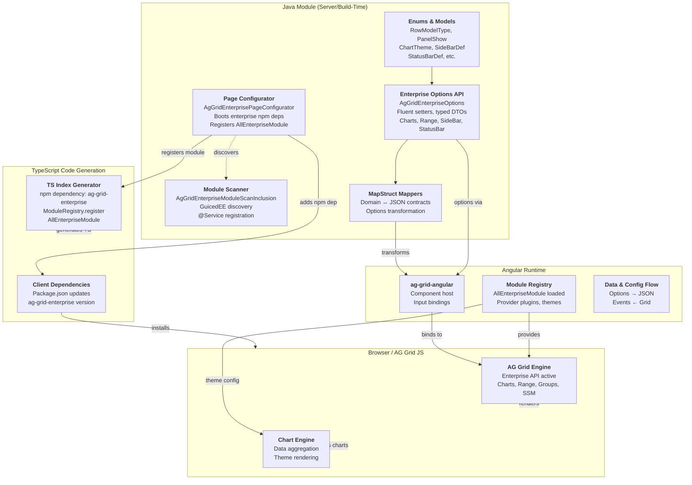

# C4 Container Diagram — AgGridEnterprise

Containers/major subsystems within the AgGridEnterprise plugin.

## Container Responsibilities

### Java Module (Server/Build-Time)

**Enterprise Options API**
- Typed setters for enterprise-only features
- Fluent builder pattern (CRTP): `new AgGridEnterprise<T>().enableCharts().sideBarFiltersAndColumns()`
- Extends `AgGridOptions` from community plugin

**Enums & Models**
- `RowModelType` — clientSide, serverSide, viewport, infinite
- `PanelShow` — rowGroupPanelShow, pivotPanelShow (always/onlyWhenGrouping/never)
- `ChartTheme` — ag-default, ag-vivid, etc.
- POJOs — `SideBarDef`, `StatusBarDef`, `SideBarToolPanelDef`, `StatusBarPanelDef`

**Page Configurator**
- IPageConfigurator implementation
- Boots enterprise npm dependency (`ag-grid-enterprise`)
- Registers `AllEnterpriseModule` with Angular ModuleRegistry
- Declared via Java @Service; auto-discovered by GuicedEE

**Module Scanner**
- GuicedEE `IGuiceScanModuleInclusions` implementation
- Enables DI and classpath scanning for enterprise features

**MapStruct Mappers**
- Transforms domain POJOs → AG Grid JSON contracts
- Handles nested objects (Charts config, SideBar panels, etc.)
- Ensures serialization correctness

### TypeScript Code Generation

**TS Index Generator**
- Auto-generates `index.ts` that imports and registers `AllEnterpriseModule`
- Pulled from `ag-grid-enterprise` npm package
- Executed at build time by Page Configurator

**Client Dependencies**
- Adds `ag-grid-enterprise` to `package.json`
- Managed by ConfigProv; installed at frontend build time

### Angular Runtime

**ag-grid-angular Component**
- Receives `AgGridEnterpriseOptions` as input bindings
- Two-way data flow: options → grid, events ← grid

**Module Registry**
- Loads `AllEnterpriseModule` from TS Index
- Provider plugins register Charts, Range, Row Groups, etc.
- Theme configuration applied

**Data & Config Flow**
- Options serialized via Jackson → JSON
- Grid events emitted via RxJS observables

### Browser / AG Grid JS

**AG Grid Engine**
- Enterprise API active (Charts, Range Selection, Row Grouping, Server-Side Model)
- Deserializes JSON options
- Handles grid lifecycle

**Chart Engine**
- Aggregates row data per chart config
- Renders themed charts via AG Grid Charts library

## Key Data Flows

1. **Options Path** — Java EnterpriseOptions → MapStruct → JSON → Angular binding → AG Grid JS
2. **Module Path** — Page Configurator (boot) → npm dep added → TS Index generated → ModuleRegistry → Angular loads enterprise features
3. **Event Path** — AG Grid JS events → Angular observable → Java callback/listener

