# C4 Context Diagram — AgGridEnterprise

System context showing AgGridEnterprise positioned within the ecosystem.

```mermaid
graph TB
    User["👤 Java/Web Developer"]
    
    AgGridEnt["<b>AgGridEnterprise Plugin</b><br/>JWebMP Plugin<br/>Provides typed Enterprise features"]
    
    JWebMP["<b>JWebMP Core</b><br/>Java Web UI Framework<br/>Fluent API, Component Model"]
    
    AgGridCommunity["<b>AgGrid Community Plugin</b><br/>JWebMP Community Grid<br/>Base component & types"]
    
    AgGridJS["<b>AG Grid Enterprise</b><br/>JavaScript/npm Package<br/>ag-grid-enterprise<br/>AllEnterpriseModule"]
    
    Angular["<b>Angular</b><br/>Frontend Framework<br/>Module Registry, RxJS"]
    
    Browser["<b>Web Browser</b><br/>ag-grid-enterprise loaded<br/>Charts, Range, Row Groups rendered"]
    
    GuicedEE["<b>GuicedEE</b><br/>Dependency Injection<br/>IPageConfigurator, Module Wiring"]
    
    User -->|uses| JWebMP
    JWebMP -->|depends on| AgGridCommunity
    AgGridEnt -->|extends| AgGridCommunity
    AgGridEnt -->|configures| JWebMP
    JWebMP -->|generates TS Code| Angular
    Angular -->|loads| AgGridJS
    Angular -->|sends to| Browser
    AgGridEnt -->|uses| GuicedEE
    GuicedEE -->|wires| AgGridJS
    AgGridJS -->|renders| Browser
    Browser -->|displays| User
```

## Context Description

- **User (Java Developer)** — Writes Java code using JWebMP fluent API; extends `AgGridEnterprise<T>` component
- **JWebMP Core** — Foundation framework providing Component model, Fluent builders, TS code generation
- **AgGridEnterprise Plugin** — This plugin; extends community AgGrid and adds Enterprise-only options (Charts, Range Selection, Row Groups, Server-Side Model, etc.)
- **AgGrid Community Plugin** — Base JWebMP plugin for AG Grid community; provides grid options, column definitions, events
- **GuicedEE** — Dependency injection and module discovery; IPageConfigurator boots enterprise dependencies
- **Angular** — Frontend runtime; hosts ag-grid-angular component and registers ag-grid-enterprise modules
- **AG Grid Enterprise (JS)** — Official AG Grid Enterprise npm package; provides Charts, Range, Row Groups, Status Bar, etc.
- **Browser** — Runtime execution; renders grid, charts, and interactive features

## Key Interactions

1. **Boot-Time** → Page Configurator discovers AgGridEnterprise, registers enterprise npm deps and Angular modules
2. **Development** → Developer writes `new AgGridEnterprise<T>()` in Java; calls enterprise methods (enableCharts, sideBarFiltersAndColumns)
3. **Code Generation** → JWebMP generates TypeScript; includes ag-grid-enterprise module registration
4. **Runtime** → Angular loads enterprise features; grid renders with full Enterprise API available

