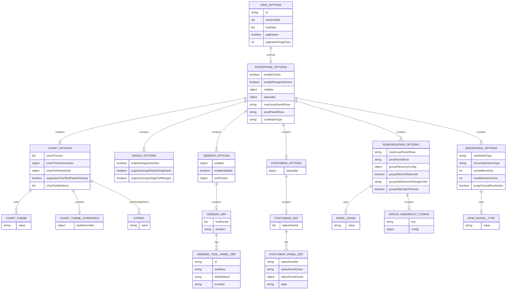

# Entity-Relationship Diagram — Enterprise Options Model

Structure of the Enterprise Options class hierarchy and relationships.



## Entity Relationships

### Inheritance Hierarchy
```
AgGridOptions (JWebMP Community)
    ↓
AgGridEnterpriseOptions (This plugin)
```

- `AgGridEnterpriseOptions` extends `AgGridOptions`
- Inherits all community features (basic grid options, columns, rows, pagination)
- Adds enterprise-only fields and methods

### Composition Structure

**AgGridEnterpriseOptions** contains:

1. **ChartOptions**
   - `enableCharts: Boolean`
   - `chartThemes: List<ChartTheme>` (enum values)
   - `chartThemeOverrides: Object` (custom CSS/styling)
   - `chartToolPanelsDef: Object` (tool panel config)
   - `chartToolbarItems: List<String>` (toolbar items: "chartDownload", "chartOpenChartToolPanel")

2. **RangeSelectionOptions**
   - `enableRangeSelection: Boolean`
   - `suppressCopyRowsToClipboard: Boolean`
   - `suppressCopySingleCellRanges: Boolean`

3. **SideBarOptions**
   - `sideBar: SideBarDef` (composite POJO)
     - `toolPanels: List<SideBarToolPanelDef>`
       - `id: String` (e.g., "columns", "filters")
       - `labelKey: String` (i18n key)
       - `labelDefault: String` (default label)
       - `iconKey: String` (icon identifier)
     - `position: String` ("left" or "right")

4. **StatusBarOptions**
   - `statusBar: StatusBarDef` (composite POJO)
     - `statusPanels: List<StatusBarPanelDef>`
       - `statusPanelId: String`
       - `statusPanelClass: String`
       - `statusPanelComp: Object` (component reference)
       - `align: String` ("left", "center", "right")

5. **RowGroupingOptions**
   - `rowGroupPanelShow: PanelShow` (enum: ALWAYS, ONLY_WHEN_GROUPING, NEVER)
   - `pivotPanelShow: PanelShow` (enum: ALWAYS, NEVER)
   - `groupHierarchyConfig: Map<String, Object>` (custom hierarchy definitions)
   - `groupAllowUnbalanced: Boolean`
   - `groupHideParentOfSingleChild: String` (true/"leafGroupsOnly"/false)
   - `groupHideOpenParents: Boolean`

6. **ServerSideOptions**
   - `rowModelType: RowModelType` (enum: CLIENT_SIDE, SERVER_SIDE, VIEWPORT, INFINITE)
   - `serverSideStoreType: String` ("full" or "partial")
   - `cacheBlockSize: Integer` (rows per block)
   - `maxBlocksInCache: Integer` (max blocks in memory)
   - `purgeClosedRowNodes: Boolean` (free memory when groups closed)

## Enum Types

### ChartTheme
- `AG_DEFAULT` → `"ag-default"`
- `AG_VIVID` → `"ag-vivid"`
- `AG_MATERIAL` → `"ag-material"`
- `AG_SHEETS` → `"ag-sheets"`
- `POLYCHROMA` → `"polychroma"`

### PanelShow
- `ALWAYS` → `"always"`
- `ONLY_WHEN_GROUPING` → `"onlyWhenGrouping"`
- `NEVER` → `"never"`

### RowModelType
- `CLIENT_SIDE` → `"clientSide"`
- `SERVER_SIDE` → `"serverSide"`
- `VIEWPORT` → `"viewport"`
- `INFINITE` → `"infinite"`

## JSON Serialization Example

When serialized to JSON:

```json
{
  "enableCharts": true,
  "chartThemes": ["ag-default", "ag-vivid"],
  "enableRangeSelection": true,
  "sideBar": {
    "toolPanels": [
      {
        "id": "columns",
        "labelKey": "ag.sideBar.columns",
        "labelDefault": "Columns",
        "iconKey": "columns"
      },
      {
        "id": "filters",
        "labelKey": "ag.sideBar.filters",
        "labelDefault": "Filters",
        "iconKey": "filter"
      }
    ],
    "position": "left"
  },
  "statusBar": {
    "statusPanels": [
      {
        "statusPanelId": "agTotalAndFilteredRowCountComponent",
        "align": "left"
      },
      {
        "statusPanelId": "agSelectedRowCountComponent",
        "align": "center"
      }
    ]
  },
  "rowGroupPanelShow": "always",
  "rowModelType": "serverSide",
  "serverSideStoreType": "partial",
  "cacheBlockSize": 100,
  "maxBlocksInCache": 5
}
```

## Cardinality Notes

- **1-to-1 (||--||}）** — Each enterprise options instance has exactly one chart/range/sidebar/statusbar/grouping/serverside option container
- **1-to-Many (||--|{}）** — SideBarDef has many ToolPanelDef; StatusBarDef has many StatusBarPanelDef
- **0-to-1 (||--o|}）** — Optional enum or config (may be null)
- **0-to-Many (||--o{}）** — Optional list

