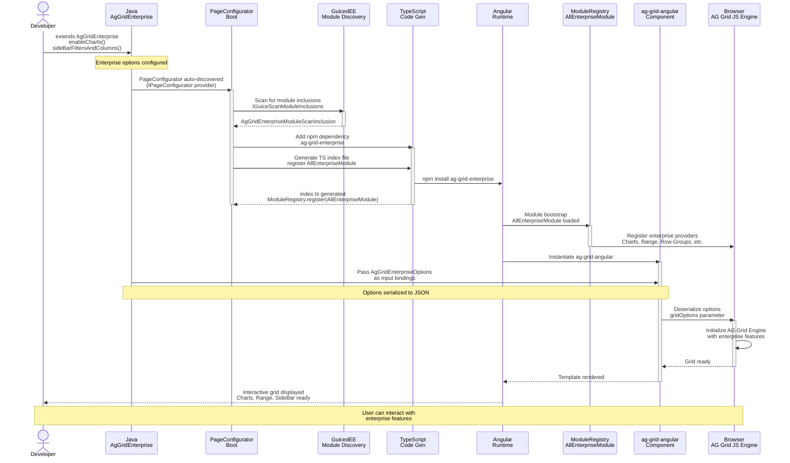

# Sequence Diagram — Grid Initialization & Page Load

Flow from Java bean declaration through Angular bootstrap to grid rendering.



## Sequence Flow Explanation

### 1. Development Phase
Developer writes Java code:
```java
public class MyGrid extends AgGridEnterprise<MyGrid> {
    public MyGrid() {
        enableCharts();
        enableRangeSelection();
        sideBarFiltersAndColumns();
    }
}
```

### 2. Boot Phase (PageConfigurator)
When JWebMP application starts:
- GuicedEE discovers `AgGridEnterprisePageConfigurator` (implements `IPageConfigurator`)
- Configurator is invoked before Angular code generation
- Action: Adds `ag-grid-enterprise` npm dependency to `package.json`
- Action: Ensures `AllEnterpriseModule` is registered in generated TS index

### 3. Code Generation Phase
JWebMP generates TypeScript:
- Includes import and registration of `AllEnterpriseModule` from `ag-grid-enterprise`
- Generated index.ts:
  ```typescript
  import { AllEnterpriseModule } from 'ag-grid-enterprise';
  ModuleRegistry.registerModules([AllEnterpriseModule]);
  ```

### 4. Angular Bootstrap Phase
Angular app starts:
- Module Registry loads `AllEnterpriseModule`
- Enterprise providers registered (Charts, Range Selection, Row Grouping, etc.)
- Theme plugins loaded

### 5. Grid Instantiation Phase
Component tree renders:
- `AgGridEnterpriseOptions` serialized to JSON by Jackson
- Passed to `ag-grid-angular` component as input bindings
- Angular sends JSON to AG Grid JS engine

### 6. Runtime Phase (Browser)
AG Grid JS engine:
- Deserializes options JSON
- Activates enterprise API
- Charts engine initialized
- Range selection enabled
- Row grouping available
- Server-Side Row Model ready if configured

### 7. Interaction
User interacts with fully functional enterprise grid:
- Creates charts from data
- Selects cell ranges
- Groups rows
- Filters via enterprise filters
- Uses side bar

---

## Error Scenarios

### Missing npm dependency
- If `ag-grid-enterprise` not installed: enterprise features not available (graceful degradation)
- Configurator should log warning

### Module not registered
- If `AllEnterpriseModule` not in TS index: feature providers not available
- Grid still renders with community features

### JSON serialization error
- Malformed options → Jackson errors logged at build time
- Recommend schema validation in tests

